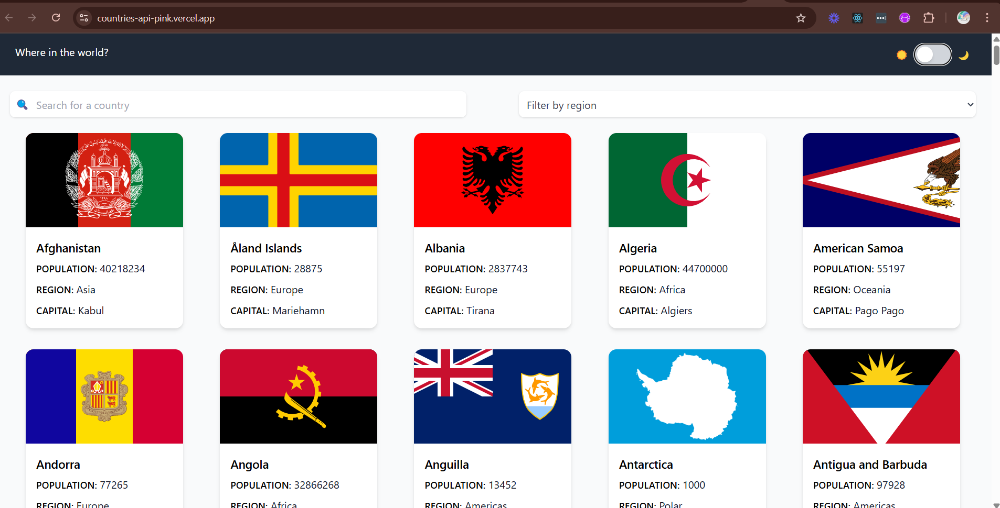

# Frontend Mentor - REST Countries API with color theme switcher solution

This is a solution to the [REST Countries API with color theme switcher challenge on Frontend Mentor](https://www.frontendmentor.io/challenges/rest-countries-api-with-color-theme-switcher-5cacc469fec04111f7b848ca). Frontend Mentor challenges help you improve your coding skills by building realistic projects. 

## Table of contents

- [Overview](#overview)
  - [The challenge](#the-challenge)
  - [Screenshot](#screenshot)
  - [Links](#links)
- [My process](#my-process)
  - [Built with](#built-with)
  - [What I learned](#what-i-learned)
  - [Continued development](#continued-development)
  - [Useful resources](#useful-resources)
- [Author](#author)
- [Acknowledgments](#acknowledgments)

## Overview

### The challenge

Users should be able to:

- See all countries from the API on the homepage
- Search for a country using an `input` field
- Filter countries by region
- Click on a country to see more detailed information on a separate page
- Click through to the border countries on the detail page
- Toggle the color scheme between light and dark mode *(optional)*

### Screenshot

### Links

<!-- - Solution URL: [Add solution URL here](https://your-solution-url.com) -->
- Live Site URL: [Add live site URL here](https://countries-api-pink.vercel.app/)

## My process

I took on a Frontend Mentor challenge (Countries API) to learn Tailwind CSS and TypeScript, using technologies like React.js and Vite. I learned through hands-on practice and faced challenges understanding TypeScript fundamentals and implementing dark mode with Tailwind. I resolved these by exploring official documentation, reading blogs, and watching beginner-friendly videos. I completed the project in a week, which helped me begin to understand TypeScript and Tailwind, as well as concepts like debouncing. This experience boosted my ability to adapt quickly to new tools and frameworks.

### Built with

- Semantic HTML5 markup
- Flexbox
- CSS Grid
- Mobile-first workflow
- [React](https://reactjs.org/) - JS library
- [TypeScript](https://typescriptlang.org/) - React framework
- [Tailwind css - v3.4.17](https://v3.tailwindcss.com/) - For styles

### What I learned

While working on this project, I learned how to declare variable and function types in TypeScript, as well as how to validate them effectively to catch potential errors early. I also gained hands-on experience in building responsive designs using Tailwind CSS, leveraging its utility-first classes and breakpoints to adapt layouts across different screen sizes.
To see how you can add code snippets, see below:

### Continued development

I want to deepen my understanding of TypeScript, especially its core concepts such as types, interfaces, generics, and type inference. Additionally, I aim to improve my use of Tailwind CSS by refining best practices for responsive design, utility class organization, and advanced features like theming and animations.

### Useful resources

- [TypeScript Introduction](https://www.w3schools.com/typescript/index.php) - A great article that helped me get started with TypeScript fundamentals.
- [TypeScript Tutorial for Beginners](https://www.youtube.com/watch?v=d56mG7DezGs) - YouTube – This video helped me clearly understand how TypeScript works and how to use it effectively.
- [Responsive Design – Tailwind CSS](https://www.youtube.com/watch?v=hX1zUdj4Dw4&t) - This tutorial guided me through building responsive interfaces using Tailwind CSS.
- [tailwind docs](https://v3.tailwindcss.com/docs/installation) - I used this official guide to install Tailwind and reference class utilities throughout the project.
- [Debounce and throttle](https://www.youtube.com/watch?v=cjIswDCKgu0&t) - YouTube – This video helped me to understand and implement debouncing.

## Author

- Website - [Add your name here](https://www.your-site.com)
- Frontend Mentor - [@yourusername](https://www.frontendmentor.io/profile/yourusername)

